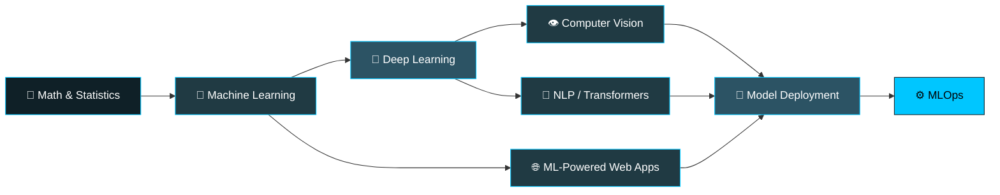

<p align="center">
  
</p>

<p align="center">
  <a href="https://www.linkedin.com/in/veer-vikram-saxena-0406bb259/"></a>
  <a href="mailto:veervikram1705@gmail.com"></a>
  <a href="https://github.com/allubhujia"></a>
  
</p>

---

## 👋 Hello, and welcome to my corner of GitHub

I'm **Veer Vikram Saxena** — a developer who sits at the intersection of **machine learning** and **web development**. My interest in this field started with a simple question that I still find fascinating: *how does a machine learn a pattern that nobody explicitly told it about?* Chasing that question is what got me into training models, and it's what keeps me experimenting today.

What I care about most is the part people often skip. A model that scores well in a notebook is only half a result — the other half is putting it somewhere a real person can actually use it. That's why I work on both sides of the stack: the training pipeline that produces the model, and the interface that makes it useful. I'd rather ship a modest model behind a clean, working app than leave a brilliant one sitting in a `.ipynb` file forever.

Right now I'm deep in **Deep Learning** — working through neural network architectures, understanding why certain designs succeed where others plateau, and getting comfortable with the practical craft of tuning, regularization, and debugging models that refuse to converge. It's humbling work. Most of my learning happens in the gap between what the paper says should happen and what my loss curve actually does.

---

## 🧑‍💻 A Snapshot

```python
class VeerVikramSaxena:

    def __init__(self):
        self.role      = "ML / DL Engineer & Web Developer"
        self.learning  = ["Deep Learning", "Neural Architectures", "MLOps"]
        self.building  = ["ML Models", "Full-Stack Web Applications"]
        self.seeking   = ["Mentorship in Deep Learning", "Collaborators"]
        self.philosophy = "Understand the problem before reaching for the model"

    def current_status(self):
        return "Reading papers, breaking models, fixing them, repeating."
```

<br>

| | |
|---|---|
| 🔭 **Currently building** | Projects spanning Machine Learning, Deep Learning, and Web Development |
| 🌱 **Currently learning** | Deep Learning — architectures, optimization, and deployment |
| 👯 **Open to collaborating on** | ML/DL research projects, open-source tools, full-stack applications |
| 🤝 **Looking for guidance in** | Advanced Deep Learning — CNNs, transformers, production ML |
| 💬 **Happy to talk about** | Machine Learning, Deep Learning, Web Development, getting started in ML |
| 📫 **Reach me at** | veervikram1705@gmail.com |
| ⚡ **Fun fact** | I enjoy turning real-world problems into data-driven solutions |

---

## 🧭 How I Approach Work

**Start with the problem, not the algorithm.** It's tempting to reach for the most sophisticated model available, but most problems don't need one. I try to understand the data and the actual constraints first — sometimes a well-chosen baseline beats an over-engineered network, and knowing that saves weeks.

**Treat the data as the real work.** Feature engineering, cleaning, and honest evaluation take up most of the time on any project I've worked on, and they're usually where the accuracy actually comes from. Model architecture gets the attention; data quality gets the results.

**Build the whole path.** Coming from web development gives me an advantage I appreciate more over time — I can take a model from training script to API to interface without handing it off. The full pipeline is where a project becomes something someone can use.

**Learn out loud.** I'd rather publish something imperfect and get feedback than polish quietly. Most of what I know came from reading other people's messy repos, so I try to leave mine open too.

---

## 💻 Tech Stack

<table>
  <tr>
    <td align="center" width="140"><b>Languages</b></td>
    <td></td>
  </tr>
  <tr>
    <td align="center"><b>ML / DL</b></td>
    <td></td>
  </tr>
  <tr>
    <td align="center"><b>Data</b></td>
    <td>
      
      
      
      
    </td>
  </tr>
  <tr>
    <td align="center"><b>Web</b></td>
    <td></td>
  </tr>
  <tr>
    <td align="center"><b>Tools</b></td>
    <td></td>
  </tr>
</table>

**Where I'm strongest:** Python and the scientific stack — NumPy, Pandas, scikit-learn — for everything from exploration to model evaluation. On the web side, I'm most comfortable pairing a Flask or Django backend with a React frontend, which is also the setup I reach for when I need to put a model behind an interface.

**Where I'm actively growing:** PyTorch internals, transformer architectures, and the deployment side of things — containerization, serving, and monitoring models once they're live rather than just once they're trained.

---

## 🎯 What I'm Focused On

<table>
  <tr>
    <td width="33%" valign="top">
      <h3 align="center">🧠 Deep Learning</h3>
      <p align="center"></p>
      <p align="center"><sub>Neural architectures, CNNs, transformers, and the practical craft of training models that actually converge.</sub></p>
    </td>
    <td width="33%" valign="top">
      <h3 align="center">📊 Machine Learning</h3>
      <p align="center"></p>
      <p align="center"><sub>Feature engineering, model selection, and honest evaluation — knowing when a metric is lying to you.</sub></p>
    </td>
    <td width="33%" valign="top">
      <h3 align="center">🌐 Web Development</h3>
      <p align="center"></p>
      <p align="center"><sub>React frontends, Flask and Django backends, REST APIs — the layer that makes a model usable.</sub></p>
    </td>
  </tr>
</table>

### 🗺️ My Learning Roadmap

The path I'm following, roughly in order. Solid nodes are ground I've covered; the highlighted one is where I'm heading next.



---

## 📊 GitHub Stats

<p align="center">
  
  
</p>

<p align="center">
  
</p>

<p align="center">
  
</p>

---

## 🤝 Let's Work Together

I'm genuinely open to collaboration, and I don't think you need a polished proposal to reach out. A few things I'd be glad to hear from you about:

- **You're working on an ML or DL project** and want another pair of hands — especially anything involving computer vision or applied modelling on real datasets.
- **You need a model wrapped in something usable** — an API, a dashboard, a small web app. This is the overlap I enjoy most.
- **You're further along than me in Deep Learning** and willing to point out what I'm getting wrong. Honest feedback on my code or approach is the most useful thing anyone can send me.
- **You're just starting out too.** Learning alongside someone at a similar stage beats grinding through courses alone, and I'm happy to compare notes.

<p align="center">
  <a href="https://www.linkedin.com/in/veer-vikram-saxena-0406bb259/"></a>
  <a href="mailto:veervikram1705@gmail.com"></a>
</p>

<p align="center">
  <sub>⭐ If something here is useful to you, a star on the repo genuinely helps — thanks for reading this far.</sub>
</p>


