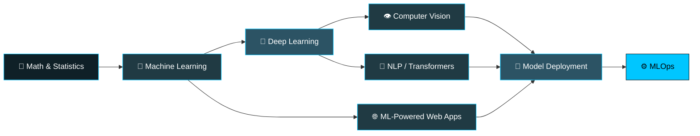

<!-- ═══════════════════ ANIMATED HEADER ═══════════════════ -->


<p align="center">
  
</p>

<p align="center">
  <a href="https://github.com/allubhujia"></a>
  <a href="https://github.com/allubhujia?tab=followers"></a>
  
</p>

<p align="center">
  <a href="https://www.linkedin.com/in/veer-vikram-saxena-0406bb259/"></a>
  <a href="mailto:veervikram1705@gmail.com"></a>
  <a href="https://github.com/allubhujia"></a>
</p>


<!-- ═══════════════════ ABOUT ═══════════════════ -->

##  About Me


```python
class VeerVikramSaxena:

    def __init__(self):
        self.role     = "ML / DL Engineer & Web Developer"
        self.learning = ["Deep Learning", "Neural Nets", "MLOps"]
        self.building = ["ML Models", "Full-Stack Web Apps"]
        self.open_to  = ["Collaboration", "Open Source"]
        self.mantra   = "Real problems → data-driven solutions"

    def say_hi(self):
        print("Thanks for stopping by — let's build something!")
```

<br>

- 🔭 &nbsp;Currently building across **Machine Learning, Deep Learning & Web Development**
- 🌱 &nbsp;Going deep on **Deep Learning** — architectures, tuning, and deployment
- 👯 &nbsp;Open to collaborating on **ML / DL / full-stack** projects
- 🤝 &nbsp;Looking for mentorship in **advanced Deep Learning** — CNNs, transformers, production ML
- 💬 &nbsp;Ask me about **ML, DL, and Web Development**
- 📫 &nbsp;Reach me at **veervikram1705@gmail.com**
- ⚡ &nbsp;Fun fact: **I enjoy turning real-world problems into data-driven solutions**

<br clear="right">


<!-- ═══════════════════ TECH STACK ═══════════════════ -->

##  Tech Stack

<table align="center">
  <tr>
    <td align="center" width="150"><b>Languages</b></td>
    <td>
      
    </td>
  </tr>
  <tr>
    <td align="center"><b>ML / DL</b></td>
    <td>
      
    </td>
  </tr>
  <tr>
    <td align="center"><b>Data</b></td>
    <td>
      
      
      
      
    </td>
  </tr>
  <tr>
    <td align="center"><b>Web</b></td>
    <td>
      
    </td>
  </tr>
  <tr>
    <td align="center"><b>Tools</b></td>
    <td>
      
    </td>
  </tr>
</table>


<!-- ═══════════════════ CURRENT FOCUS (replaces Projects) ═══════════════════ -->

##  What I'm Focused On

<table align="center">
  <tr>
    <td width="33%" align="center">
      <br>
      <b>🧠 Deep Learning</b><br>
      <sub>CNNs · Transformers · Model tuning</sub><br><br>
      
    </td>
    <td width="33%" align="center">
      <br>
      <b>📊 Machine Learning</b><br>
      <sub>Feature engineering · Evaluation</sub><br><br>
      
    </td>
    <td width="33%" align="center">
      <br>
      <b>🌐 Web Development</b><br>
      <sub>React · Flask · REST APIs</sub><br><br>
      
    </td>
  </tr>
</table>

<div align="center">

### 🗺️ Learning Roadmap

</div>




<!-- ═══════════════════ STATS ═══════════════════ -->

##  GitHub Stats

<p align="center">
  
  
</p>

<p align="center">
  
</p>

<p align="center">
  
</p>

<p align="center">
  
</p>

### 🐍 Watch my contributions get eaten

<p align="center">
  
</p>


<!-- ═══════════════════ FOOTER ═══════════════════ -->

<div align="center">

### 💭 Dev Quote of the Day


<br>

### 🤝 Let's Connect

<a href="https://www.linkedin.com/in/veer-vikram-saxena-0406bb259/"></a>
<a href="mailto:veervikram1705@gmail.com"></a>

<br><br>


**⭐ If you like my work, consider starring a repo — it makes my day!**

</div>


